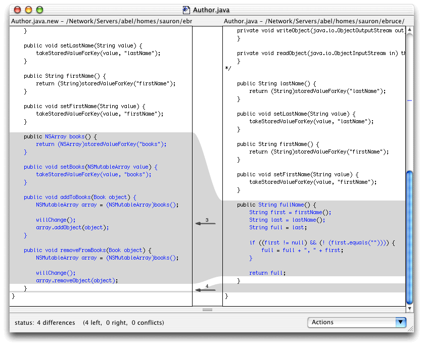
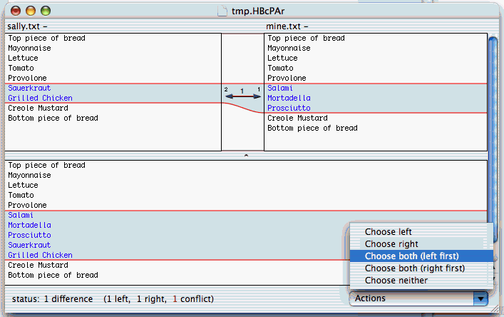

# Using FileMerge as a diff command for Subversion (and Mercurial)

## Introduction

Subversion principally uses the [copy-modify-merge](http://svnbook.red-bean.com/en/1.5/svn.basic.vsn-models.html#svn.basic.vsn-models.copy-merge) versioning model to allow concurrent collaboration on the same set of files. For this to work well, it is crucial to have good tools to view and merge the differences between files.

The built-in `diff` and `diff3` tools (from [diffutils](http://www.gnu.org/software/diffutils/diffutils.html)) go a long way to provide this functionality for text files on the command line. They do have some limitations though, including:

*   Worthless to find interline changes in long lines
*   Output of diff can be hard to read
*   No interactive merge support

Apple's [Developer Tools](http://developer.apple.com/technology/) for Mac OS X include FileMerge, a graphical tool to compare and merge files. FileMerge can be much handier to use; unfortunately, it doesn't integrate with Subversion straightforwardly. It can be opened from the command line with the `opendiff` command, but its interface differs from that of `diff` and `diff3`. It returns immediately (i.e. it forks and does not block) and it expects different arguments. Some wrapper scripts are thus required to call FileMerge from Subversion.



## Wrapper Scripts for FileMerge

This projects provides Bash scripts for this task. Four scripts are provided: `fmdiff`, `fmdiff3`, `fmresolve` and `fmmerge`. They are described below. The location of FileMerge is determined through a symbolic link in the `PATH` environment. The included Makefile can create this link from the output of `xcode-select -p` or checking a number of standard locations. To do this:

```bash
$ make
```

Afterwards, you can do the following to install all of the scripts in `/usr/local/bin`:

```bash
$ sudo make install
```

### fmdiff

`fmdiff` has an interface similar to `diff` and can be used with Subversion's `--diff-cmd` option. The canonical case is:

```bash
$ svn diff --diff-cmd fmdiff [other diff options, files or URLs]
```

Subversion will start FileMerge for each file with differences. It will wait for you to quit FileMerge (⌘-Q) to clean up and show the next file (if any). The script cannot show the labels from Subversion in FileMerge. As a resort, it will print these on the command line:

```
Starting FileMerge...
Left: lock.c (revision 14670)
Right: lock.c (revision 14675)
```

Additionally, if `fmdiff` finds that you have `growlnotify` installed, it will use this to show a similar message as a [Growl](http://growl.info/) notification.

**Advanced tip:** The merge pane at the bottom of the FileMerge window is normally not used for `fmdiff`. However, when `fmdiff` detects that the right-hand file is part of a working copy, it will instruct FileMerge to use this right-hand file as the merge file as well. This means that you can compose a new version of this file in the merge pane by accepting or rejecting the changes that have occurred. When you instruct FileMerge to save (⌘-S), the right-hand file will be replaced with the new version from the merge pane.

### fmdiff3

Unsurprisingly, `fmdiff3` is the `diff3`-equivalent of `fmdiff`. It can be used with Subversion's `--diff3-cmd` option.

`diff3` will merge the changes from two different versions that have a common ancestor. It is used by Subversion on an `update` (to merge changes from the repository with local changes) or a `merge` operation. Suppose that you have made local changes in a working copy and that meanwhile the repository was updated. To merge your local changes with those of the repository in FileMerge, do:

```bash
$ svn update --diff3-cmd fmdiff3
```

**Note:** By using the ancestor information, `diff3` can merge the changes automatically, provided that there are no conflicting changes. The standard `diff3` merge is therefore non-interactive. If conflicts do occur, they are marked in brackets, and Subversion expects you to [resolve the conflicts](http://svnbook.red-bean.com/en/1.5/svn.tour.cycle.html#svn.tour.cycle.resolve) later on, after the (partial) merge. `fmdiff3`, in contrast, does the merge interactively and completely. First, It will fire up FileMerge with the relevant ancestor information, and FileMerge will merge the non-conflicting changes by itself on startup. `fmdiff3` then expects that you complete the merge by resolving the conflicts through FileMerge's facilities. When you save the merged version (⌘-S) and quit FileMerge (⌘-Q), the result is given back to Subversion as a completely merged version. So the conflict state is not needed anymore.



### fmresolve

Whereas `fmdiff3` can be useful when you anticipate conflicts during an `update` or a `merge`, it's sometimes unpractical that you have to decide to use FileMerge _a priori_. When you did a standard `update` or `merge` using the built-in `diff3`, and you are faced with one or more files in conflicting state, `fmresolve` allows to use FileMerge _a posteriori_ to resolve the conflicts.

```bash
$ fmresolve <conflictfile>
```

This will start FileMerge with the appropriate versions and ancestor to reinitiate the merge. Non-conflicting changes are resolved automatically at startup; you can then resolve the remaining changes. After you save (⌘-S) and quit FileMerge (⌘-Q), you can signal to Subversion that the conflicts were resolved:

```bash
$ svn resolved <conflictfile>
```

### fmmerge (Subversion 1.5)

Starting from version 1.5, Subversion supports [interactive conflict resolution](http://svnbook.red-bean.com/en/1.5/svn.tour.cycle.html#svn.tour.cycle.resolve). That means that the above description of an `update` scenario is no longer entirely accurate: when Subversion detects conflicting changes during an update, it will provide an interactive menu with several options. If you select the <q>postpone</q> option (`p`), the old behavior is applied, and you may still use `fmresolve` to resolve the conflict later on.

However, you can also choose to resolve the conflict immediately, either by accepting one version entirely (and discarding the changes in the other version), or by launching an external tool with the <q>launch</q> option (`l`). `fmmerge` is a wrapper to use FileMerge as such an external merge tool. It can only be activated through the Subversion configuration file (see below), where it must be configured as the variable `merge-tool-cmd`.

## Permanently Using FileMerge with Subversion

You can configure the `fmdiff` scripts to be used permanently, by setting the options `diff-cmd` and `diff3-cmd` in the "editors" section of the runtime config file (i.e. `~/.subversion/config`). After this change, you no longer have to include the `--diff-cmd` and `--diff3-cmd` options when invoking Subversion.

More info: [Subversion Book - Runtime Config Area](http://svnbook.red-bean.com/en/1.5/svn.advanced.confarea.html#svn.advanced.confarea.opts.config).

## Using FileMerge with Mercurial (experimental)

[Mercurial](http://mercurial.selenic.com/) (`hg`) is a distributed version control system with a similar need for good tools to view and merge the differences between files. Like Subversion, Mercurial can be configured to use external tools for these tasks.

### Viewing differences

External diff tools are used by means of the [Extdiff extension](http://mercurial.selenic.com/wiki/ExtdiffExtension). Include the following in your `~/.hgrc`:

```
[extensions]
extdiff =

[extdiff]
cmd.fmdiff =
```

Afterwards, you can use the following command to inspect changes using FileMerge:

```bash
$ hg fmdiff [other-diff-options]
```

### Merging

External merge tools can also be configured. Include the following in your `~/.hgrc`:

```
[ui]
merge = internal:merge

[merge-tools]
fmmerge.args = $base $other $local $output
```

Afterwards, whenever a merge conflict arises, you can invoke FileMerge on a conflicting file with the command:

```bash
$ hg resolve -t fmmerge <conflictfile>
```

If you save the result of the merge in FileMerge, the conflict is marked as resolved. If you exit without saving, the conflict is left unresolved.

In this configuration, the internal merge mechanism is still used by default. We only invoke FileMerge on-demand, when attempting a re-merge with `hg resolve`. If you want Mercurial to always use FileMerge, leave out the line containing `internal:merge`.

## Credits

Written by Bruno De Fraine, with contributions from users.
